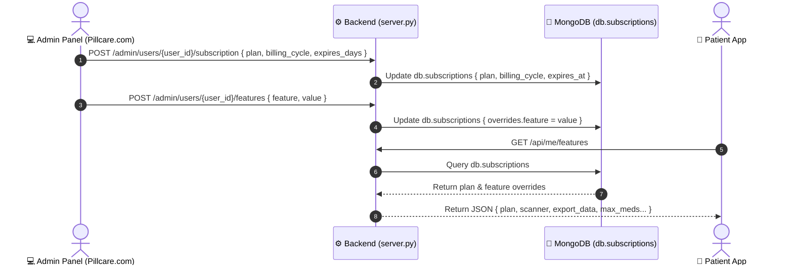
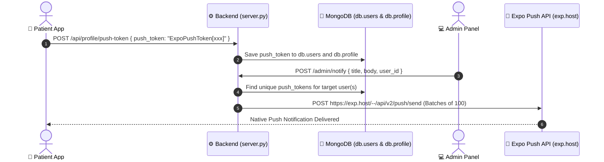

# 🏗️ PillCare Platform Architecture & Integration Reference

> **System Version**: 2026.1  
> **Backend Service**: GCP Cloud Run (`https://pillcare-backend-1082668880575.europe-west1.run.app`)  
> **Primary Domain**: `https://pillcare.in` | Admin Subdomain: `https://admin.pillcare.in`

---

## 1. Multi-Repository System Architecture

PillCare operates as a decoupled 2-repository microservice ecosystem:

```mermaid
graph TD
    subgraph Repo 1: Pillcare.com (Website & Admin UI)
        W[pillcare.in / admin.html]
        W_CSS[styles.css]
        W_JS[script.js]
    end

    subgraph Repo 2: Pillcare-Reminder_V01 (App & Backend API)
        API[FastAPI Backend - server.py]
        MOB[React Native App - Expo SDK 50]
        DB[(MongoDB Database)]
    end

    W -->|HTTPS / Rest APIs| API
    MOB -->|HTTPS / Rest APIs| API
    API -->|Read/Write| DB
    API -->|Push Gateway| EXPO[Expo Push API - exp.host]
```

### Repository Mapping

| Repository | GitHub Origin | Local Path | Component Scope |
| :--- | :--- | :--- | :--- |
| **Repo 1: Website & Admin** | [`https://github.com/ntnr737/Pillcare.com`](https://github.com/ntnr737/Pillcare.com) | `/Users/nitin/Documents/PillCare-Reminder_V01.1/pillcare-website` | Static Website, `admin.html` Mission Control UI |
| **Repo 2: App & Backend** | `ntnr737/Pillcare-Reminder_V01` | `/Users/nitin/Documents/PillCare-Reminder_V01.1/Pillcare-Reminder_V01` | FastAPI Server (`backend/server.py`), React Native App (`frontend/`) |

---

## 2. End-to-End Integration Contracts & Protocols

### A. Subscription Tiers & 1-Click Feature Override Engine

Admin Panel (`admin.html`) updates subscription plans (Free, Basic ₹30, Premium ₹99, Enterprise) and billing cycles (Monthly 30d, Annual 365d) or toggles specific features (OCR Scanner, PDF Export, Yoga Full, Brand $\rightarrow$ Generic, Caregivers).



#### Endpoints:
- `POST /admin/users/{user_id}/subscription`: Set subscription plan, billing cycle, expiration, and notes.
- `POST /admin/users/{user_id}/features`: Apply single-click feature overrides (`export_data`, `scanner`, `yoga_full`, `brand_generic`, `caregiver_alerts`).
- `DELETE /admin/users/{user_id}/features/{feature}`: Remove a manual override.
- `GET /api/me/features`: Mobile client endpoint to sync active privileges.

---

### B. High-Reliability Push Notification Pipeline

Supports both `ExpoPushToken[...]` and `ExponentPushToken[...]` formats across Expo SDK versions.



#### Endpoints:
- `POST /api/profile/push-token`: Registers/updates device push token (accepts `{ push_token }` or `{ token }`).
- `POST /admin/notify`: Broadcasts push notification globally or to specific target `user_id`/`email`.

---

### C. Swiggy/Zomato Flash Announcements

Allows broadcasting instant in-app promotions, system alerts, or feature releases to specific subscription tiers.

#### Endpoints:
- `POST /admin/announcements`: Publish announcement (`title`, `body`, `type`, `target_plan`, `link_url`).
- `GET /admin/announcements`: List active announcements.
- `DELETE /admin/announcements/{ann_id}`: Revoke announcement.
- `GET /api/announcements/active?plan={plan}`: Mobile app endpoint to display flash banner on Today screen.

---

### D. Analytics, Demographics & Financial Intelligence

- `GET /admin/stats`: Business KPIs (Total Users, 7-Day Active Users, Doses Logged, Adherence Rate).
- `GET /admin/revenue`: MRR Estimate, Conversion Rate, Plan Breakdown.
- `GET /admin/analytics/financials`: JP Morgan unit economics (MRR, ARR, ARPU, LTV, Paid Conversion %).
- `GET /admin/analytics/healthcare-intelligence`: Refill GMV, Low-Stock Radar ($\le 3$ doses), Patients needing refills, Caregiver alert logs.
- `GET /admin/analytics/cohorts`: Cohort retention analysis (1d, 7d, 14d, 30d cohorts).
- `GET /admin/analytics/filter`: Multi-metric filtering (`metric`, `min_value`, `max_value`, `plan`).
- `GET /admin/analytics/users/comprehensive`: User engagement scores, adherence, lifetime value, churn risk (`low`, `medium`, `high`), and streaks.
- `GET /admin/analytics/location`: State, city, and demographic distribution.
- `GET /admin/analytics/devices`: Operating systems, device brands, and app build versions.
- `GET /admin/export/users`: Excel `.xlsx` export of user dataset.

---

## 3. MongoDB Database Schema Definitions

| Collection | Key Fields | Purpose |
| :--- | :--- | :--- |
| `users` | `id`, `email`, `name`, `push_token`, `created_at` | Core user identity & token records |
| `profile` | `user_id`, `nickname`, `phone`, `caregiver_phone`, `location_city`, `location_state`, `gender`, `year_of_birth` | Onboarded patient profiles |
| `subscriptions` | `user_id`, `plan`, `billing_cycle`, `status`, `expires_at`, `overrides` | Subscription tiers & feature flags |
| `medications` | `id`, `user_id`, `name`, `dosage`, `frequency`, `stock`, `active` | Patient prescriptions |
| `doses` | `id`, `user_id`, `medication_id`, `scheduled_time`, `status` (`taken`/`missed`) | Dose adherence history |
| `announcements` | `id`, `title`, `body`, `type`, `target_plan`, `link_url`, `created_at` | Active flash announcements |
| `analytics` | `event`, `user_id`, `ts`, `props` | Platform telemetry & event stream |
| `audit_log` | `user_id`, `action`, `ip`, `ts` | User session & security logs |
| `admin_login_attempts` | `ip`, `email`, `success`, `ts` | Security brute-force rate limiter |

---

## 4. Performance & Concurrency Rules

1. **Concurrent Batch Aggregation (`asyncio.gather`)**:
   - All admin endpoints returning user lists or analytics must avoid sequential `for` loop database calls.
   - Batch queries using MongoDB `$in` operator and `asyncio.gather` ensure API response times stay **< 50 milliseconds**.
2. **FastAPI Static Route Order**:
   - Static endpoints (e.g. `/admin/analytics/users/comprehensive`) MUST be declared **before** parameterized endpoints (e.g. `/admin/analytics/users/{user_id}`) to prevent route collision.
3. **Authentication Resilience**:
   - `require_admin` dependency enforces header `x-admin-secret` matching `ADMIN_SECRET` environment variable or Google OAuth JWT admin claims.

---

*This document serves as the authoritative architectural record for both `Pillcare.com` and `Pillcare-Reminder_V01` repositories.*
